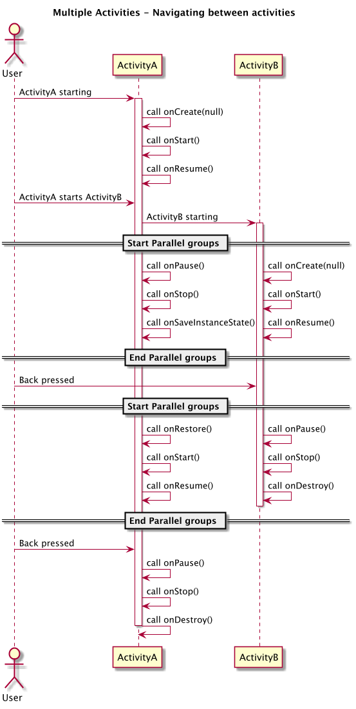
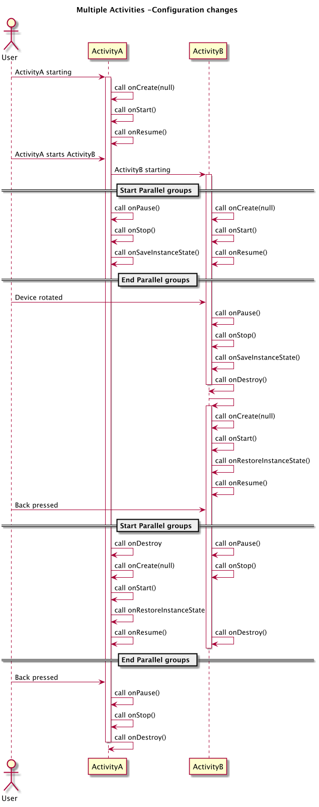
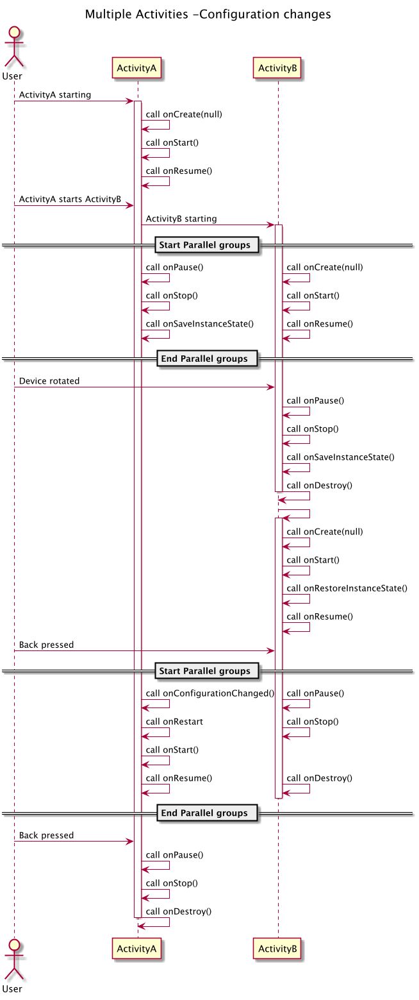

# Multiple Activities

> In parallel groups, the order of events is not guaranteed.

## Scenario 1

> Navigating between activities

1. When the ActivityB is started, the ActivityA is on stopped status.

## Scenario 2

> Configuration changes

|Scenario 2-1|Scenario 2-2|
|---|---|
|||

1. When user rotates device that should let users continue exactly where the left off.

2. Device rotation: If an activity without `android:configChanges`, the actiivty is completely destoryed (Scenario 2-1), otherwise an activity with `android:configChanges`, the activity dose not destory, only call `onConfigurationChanged` to notify changes (Scenario 2-2, ActivtyA with onConfigurationChanged, ActivityB without onConfigurationChanged).

