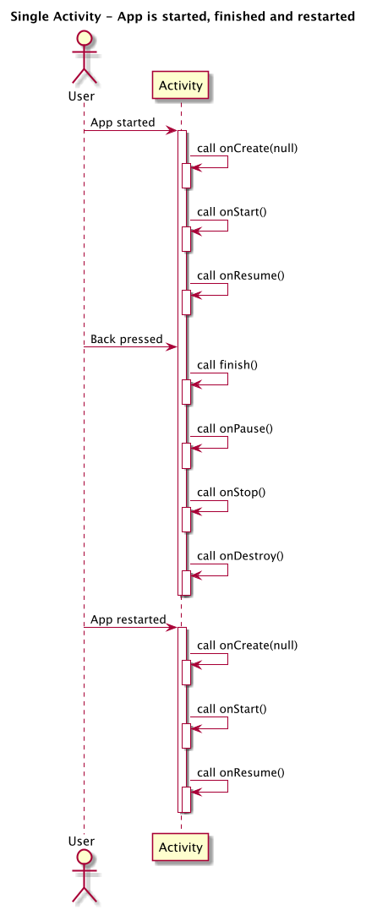
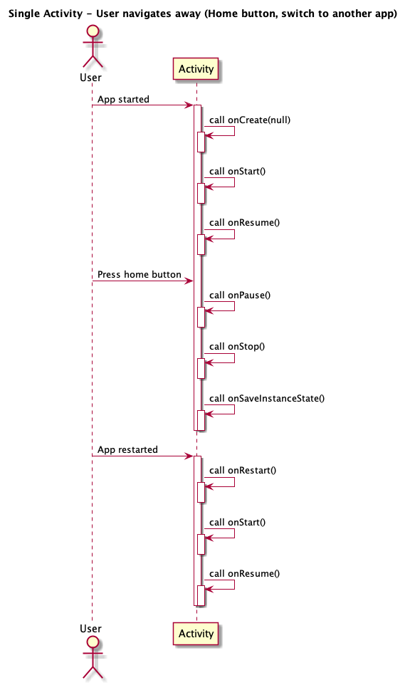
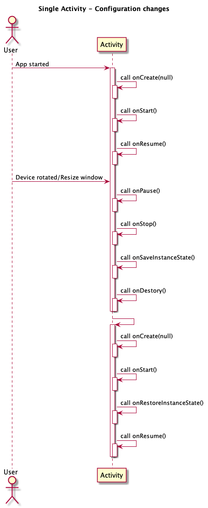
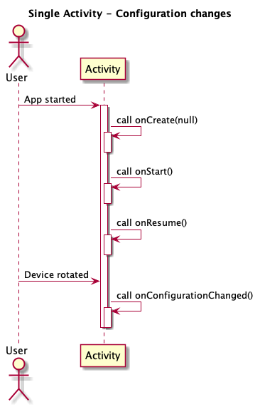
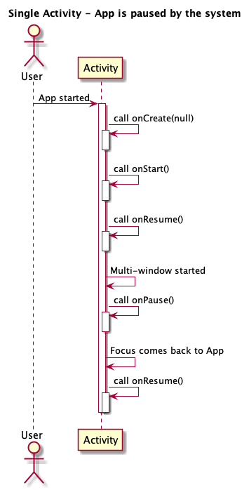

# Single Activity

## Scenario 1

> App is started, finished and restarted.

1. At the first-time app started, an activity lifecycle is `onCreate()` -> `onStart()` -> `onResume()` sequence. The `onCreate()` method doesn't have a Bundle argument when the app is first-time started.
2. When app is finished (Back pressed or call finish()), an activity lifecycle is `onPause()` -> `onStop()` -> `onDestroy()`. The `onSaveInstanceState()` is not called, because the activity is finished that doesn't need to save state.
3. A reopened app that a run sequence is equal the first-time launch app.

## Scenario 2

> User navigates away

1. When user presses the home button or switchs to another app (via a notification, accepting a call, etc.), the activity enters the stopped state and calls onSaveInstanceState to store the app state in case the system kills the app's process late on.
2. This assuming the app's process isn't killed, the activity is kept in memeory and retaining all state. When user restart app, the activity comes back to the foreground, the activity restores this information.

## Scenario 3

> Configuration changes

|Scenario 3-1|Scenario 3-2|
|---|---|
|||

1. When user rotates device or resizes window that should let users continue exactly where the left off.

2. Device rotation: If an activity without `android:configChanges`, the actiivty is completely destoryed (Scenario 3-1), otherwise an activity with `android:configChanges`, the activity dose not destory, only call `onConfigurationChanged` to notify changes (Scenario 3-2).

3. Resize window in multi-window mode, either activity with or without `android:configChanges`, the activity is completely destroyed and re-build (Scenario 3-1).

## Scenario 4

> App is paused by the system

1. Another app (a purchase dialog, a permission dialog, a third-party login dialog, and an intent chooser, ...) partially convers the foreground app.

2. An AlertDialog or a DialogFragment shown by the same app, that won't pause the underlying activity.

3. User is receiving a new notification or pulling down the notification bar won't pause the underlying activity.

