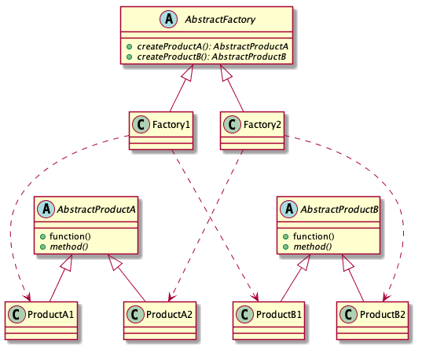

# Abstract Factory pattern

> Encapsulate a group of individual factories that have a common theme without specifying their concrete classes.

## Advantages

* Encapsulate

Encapsulate object creation in a separate factory object.

## Disadvantages

If you want to scale Product that need to modify all related classes.

## Class diagram

