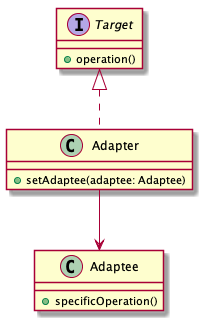
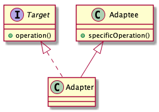

# Adapter pattern

> An adapter allows two incompatible interfaces to work together. Convert the interface of a class into another interface clients expect.

## Adavantages

The adapter pattern allows otherwise incompatible classes to work together by converting the interface of one class into an interface expected by the clients.

* Increasing the class's transparency
* Increasing the class's reusability

## Disvatanges

The class type of adapter pattern is not suitability unsupported multiple inheritance languages.

## Class diagram

* Object Adapter pattern

The object adapter implements the target interface by delegating to an adaptee object at run-time.

* Class Adapter pattern

The class adapter implements the target interface by inherithing from an adaptee class at compile-time.

