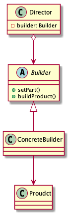

# Builder pattern

> Separate the construction fo a complex object from its representation so that the same construction process can create different representations.

## Advantages

* Encapsulate

Encapsulates code for construction and representation.

* Flexible

Allows user to vary to product's internal representation, and provides control over steps of construction process.

## Disadvantages

* Requires creating a separate `ConcreteBuilder` for each different type of product.
* Dependency injection may be less supported.

## Class diagram

