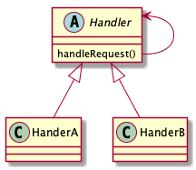

# Chain of responsibility pattern

> Avoid coupling the sender of a request to its receiver by giving more than one object a chance to handle the request. Chain the receiving objects and pass the request along the chain until an object handles it.

## Advantages

* Flexibility

Decoupling a requester and a handler, the requester does not need to know who is the handler.

## Disadvantages

Each request needs to visit a chain from head to tail.

<b>Note</b>: Limit a chain size.

## Class diagrams

