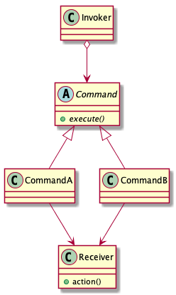

# Command pattern

> Encapsulate a request as an object, thereby letting you parameterize clients with different requests, queue or log requests, and support undoable operations.

## Advantages

* Encapsulate

Define separate command objects that encapsulate a request detail.

* Decoupling

A invoker and a receiver are independent. Any requests through commands.

* Undo/Redo

Command pattern with queue achieves the Undo/Redo function.

## Disadvantages

Number of command subclasses are grow up quickly.

## Class diagram

