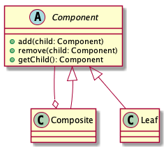
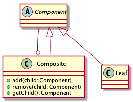

# Composite pattern

> Compose objects into tree structures to represent part-whole hierarchies. Composite lets clients treat individual objects and compositions of objects uniformly.

## Advantages

* Simple operation for high-level module

Tree structure of all elements are `Component` class, let the high-level module can treat part and whole objects uniformly.

* Flexible add/remove nodes

The tree structure is easily add/remove nodes.

## Disadvantages

If the composite pattern implemented by Safety type that will conflict the Dependency Inversion Principle.

## Class diagram

* Uniformity

This enables clients to treat Composite and Leaf nodes uniformly.

* Safety

A client must treat Composite and Leaf nodes differently.

