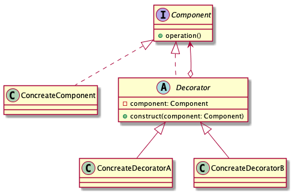

# Decorator pattern

> Attach additional responsibilities to an object dynamically keeping the same interface. Decorators provides a flexible alternative to subclassing for extending functionality.

## Advantages

* Independency

Decorator classes and Component classes are decoupled. A decorator uses extending to decorate a component, and the decorator doesn't know the detail of the component.

* Flexibility

The decorator pattern can dynamically extend the functionality of an object.

## Disadvantages

Multiple-decorators is complexity, that is like an onion, you need to peele layer by layer.

## Class diagrams

