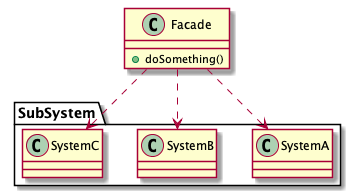

# Facade pattern

> Provide a unified interface to a set of interfaces in a subsystem. Facade defines a higher-level interface that makes the subsystem easier to use.

## Advantages

* Reduce system's dependance

Clients that access a complex subsystem directly refer to a unified interface.

* Increasing flexible

Changing a subsystem not impact user interface (Facade object).

* Increasing security

Facade object only provides a necessary interface.

## Disadvantages

Not supported Open-Closed principle. If Facade object's interface occurs error, you need to change the interface, that will impact the client.

## Class diagram

