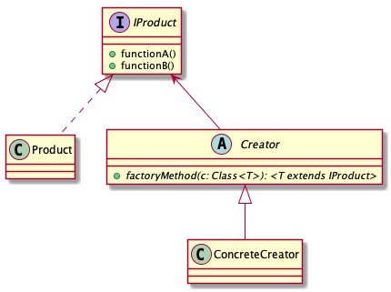

# Factory Method pattern

> Define an interface for creating an object, but let subclasses decide which class to instantiate.

## Advantages

* Extensibility

This enables subclasses to redefine which class to instantiate.

* Reduce class construction

The object creating often requires complex processes and duplication code, this pattern let subclasses decide which class to instantiate.

## Class diagram

