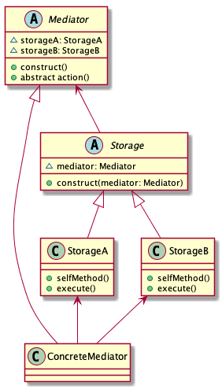

# Mediator pattern

> Define an object that encapsulates how a set of objects interact. Mediator promotes loose coupling by keeping objects from referring to each other explicitly, and it lets you vary their interaction independently.

## Advantages

* Reduce dependance

This pattern changes the original one-to-many relationship to the one-to-one relationship. Client classes can use the mediator to send messages to other clients, and can receive messages from other clients.

## Diadvantages

If the mediator grows a huge class, then its logic will become complexity.

## Class diagrams

