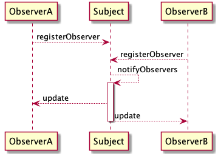
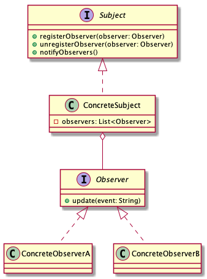

# Observer pattern

> Define a ont-to-many dependency between objects so that when one object chnages state, all its dependents are notified and updated automatically.

## Advantages

* Abstraction coupling

Observer and Observed are extend from abstraction/interface class.

## Disadvantages

If an observed has too many observers, maybe cause notify delay.

## Sequence diagrams

## Class diagrams

