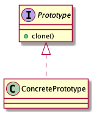

# Prototype pattern

> Specifiy the kinds of objects to create using a prototypical instance, and create new objects by copying this prototype.

## Advantages

* Good performance

The prototype pattern has directly copied an object on memeory that performance is batter than `new` a object.

## Disadvantages

* No construct constraint

The prototype pattern has directly copied an object on memory, thus the construction will be skipped.

## Shallow and Deep

* Shallow

Shallow copies duplicate as little as possible. A shollow copy of an object is a copy of the object structure, not the elements.

* Deep

Deep copies duplicate everything. A deep copy of an object is a copy of the object structure and all elements.

## Class diagrams

