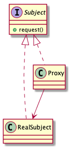
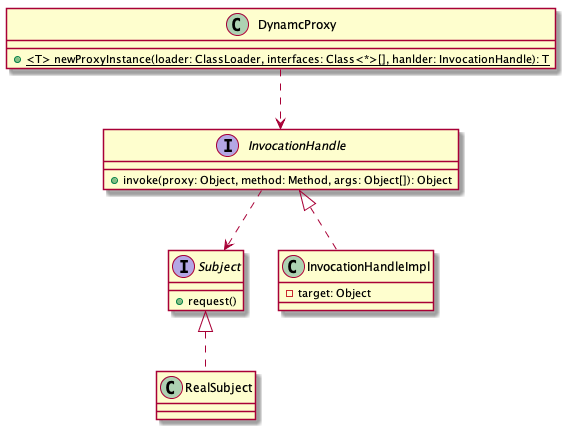

# Proxy pattern

> Provide a surrogate or placeholder for another object to contral access to it.

## Advantages

* High scalability

The business logic handled by a concrete subject class, a proxy class only implements interfaces.

## Disadvantages

If some of the client directly access the RealSubject, and some of them access the Proxy classes that might cause disparate behaviour.

## Types of proxies

* Remote proxy:

The local object is a proxy for the remote object (might belong to a different address space).

* Virtual proxy:

In place of a complex or heavy object, a proxy provides dummy data before a real object is done.

* Protection proxy:

A proxy might be used to control resource access right.

* Dynamic proxy:

A proxy does not care a proxied object in the implementation phase. Assigned a proxied object at runtime. The dynamic proxy is based on Aspect-oriented programming (AOP).

## Class diagrams

* General proxy pattern

* Dynamic proxy pattern

