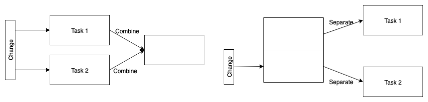

# Single Responsibility Principle

> A class should have only one reason to change.

Single Responsibility Principle (SRP) 是一個由 Robert C. Martin 提出的軟體程式設計概念，主要表達一個 Class 或 Interface 只有單一職責 (Responsibility)，"職責" 可以理解為要執行的任務。如下圖，假設有多個任務要執行，而這些任務的變化永遠是連動的就就不需要拆分，如果任務間不是連動最好在設計上將其拆分，降低耦合。

### 優點

1. 可讀性

    每一個 Class 或 Interface 都有明確的職責，提升程式碼的可閱讀性。

2. 維護性
    
    後續更動時只會對一個 Class 或 Interface 產生影響，大幅幫助擴充與修改。

### 缺點

在設計上要如何劃分職責沒有一定方式，要根據當時的時間、資源及需求等外在因素而定。

### References

* [Wikipedia's Single Responsibility Principle](https://en.wikipedia.org/wiki/Single_responsibility_principle)
* [Think you understand the Single Responsibility Principle?
](https://hackernoon.com/you-dont-understand-the-single-responsibility-principle-abfdd005b137)
* [SOLID之單一職責原則](https://ithelp.ithome.com.tw/articles/10191955)
* The Zen of Design Patterns