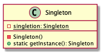

# Singleton pattern

> Ensure a class has noly one instance, and provide a global point of access to it.

## Advantages

Avoid multiple occupations of resources, and reduce memory consumption.

## Disadvantages

Difficult to expand.

## Class diagram

