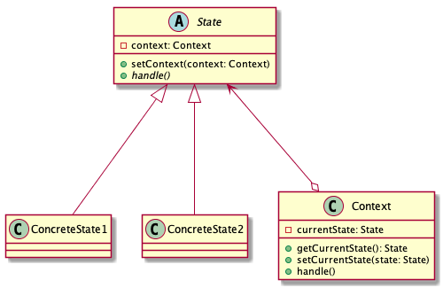

# State pattern

> Allow an object to alter its behavior when its internal state changes. The object will appear to change its class.

## Advantages

* Clear structure

Avoid using too many `switch...case` or `if...else` sentences to handle/change difference state. Reduce the program's complexity and increase extensibility.

* Encapsulation

Make a class independent of how state-specific behavior is implemented. If you want to add new states, that can be defining new state classes.

## Disadvantages

Maybe generating too many subclasses.

## Class diagram

