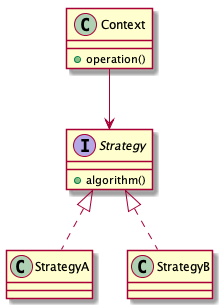

# Strategy pattern

> Define a family of algorithms, encapsulate each one, and make them interchangeable.

## Advantages

* Flexibility

This pattern is flexible to change the algorithm, for example, you want to add a new strategy, you only inherit `interface` then implement real logic in the subclass.

* Avoid multiple switch-case or if-else

You only provide a different strategy for a user, the strategy chooses is control by a user.

## Disadvantages

Each strategy has represented a class, that maybe cause too many classes.

## Class diagrams

