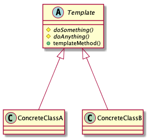

# Template Method pattern

> Define the skeleton of an algorithm in an operation, deferring some steps to subclasses. Template method lets subclasses redefine certain steps of an algorithm without changing the algorithm's structure.

## Advantages

* Extract common code

The `template mothod` avoides duplication in the code. The general workflow is implemented once in the base class's template method, and variations are implemented in the subclasses.

* Extensibility

If the subclasses want to change workflow, they only override the `template method`. In contrast, by overriding only the `hook methods`, only change certain details of the workflow, and the overall workflow is left intact.

## Disadvantages

Understanding and debugging the sequence of workflow in the Template Method pattern can be confusing. You may be not implementing an abstract method or implementing a method that shouldn't be implemented at all.

## Class diagram

